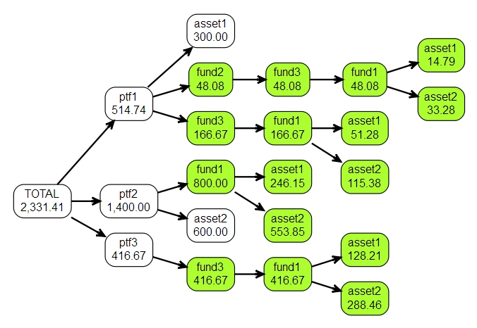

<!-- README.md is generated from README.Rmd. Please edit that file -->
lookthrough
===========

[](https://cran.r-project.org/package=lookthrough) [](https://www.tidyverse.org/lifecycle/#experimental) [](https://ci.appveyor.com/project/shrektan/lookthrough) [](https://travis-ci.org/shrektan/lookthrough) [](https://codecov.io/github/shrektan/lookthrough?branch=master)

The goal of lookthrough is to help to view the assets exposure using the look-through approach.

Installation
------------

``` r
devtools::install_github("shrektan/lookthrough")
```

Example
-------

``` r
library(lookthrough)
data(lkthr_sample)
ptfs <- as_lkthr(lkthr_sample$ptfs)
funds <- as_lkthr(lkthr_sample$funds)
lkthr_match(ptfs, funds)
lkthr_set(ptfs, lkthr_sample$attributes)
print(ptfs, "exposure", "issuer", "guarantor")
#>                     levelName  exposure    issuer guarantor
#> 1  TOTAL                      24,900.00                    
#> 2   |--ptf1                    5,300.00                    
#> 3   |   |--asset1                300.00 company_a company_b
#> 4   |   |--fund2                 900.00                    
#> 5   |   |   |--asset5            230.77                    
#> 6   |   |   |--asset3             92.31 company_b company_d
#> 7   |   |   °--fund3             576.92                    
#> 8   |   |       |--asset3        384.62 company_b company_d
#> 9   |   |       |--asset7        144.23 company_g          
#> 10  |   |       °--fund1          48.08                    
#> 11  |   |           |--asset1     14.79 company_a company_b
#> 12  |   |           °--asset2     33.28 company_a company_c
#> 13  |   |--asset3                800.00 company_b company_d
#> 14  |   |--asset4                500.00 company_e          
#> 15  |   |--asset5                800.00                    
#> 16  |   °--fund3               2,000.00                    
#> 17  |       |--asset3          1,333.33 company_b company_d
#> 18  |       |--asset7            500.00 company_g          
#> 19  |       °--fund1             166.67                    
#> 20  |           |--asset1         51.28 company_a company_b
#> 21  |           °--asset2        115.38 company_a company_c
#> 22  |--ptf2                   10,700.00                    
#> 23  |   |--fund1                 800.00                    
#> 24  |   |   |--asset1            246.15 company_a company_b
#> 25  |   |   °--asset2            553.85 company_a company_c
#> 26  |   |--asset2                600.00 company_a company_c
#> 27  |   °--asset3              9,300.00 company_b company_d
#> 28  °--ptf3                    8,900.00                    
#> 29      |--asset5                900.00                    
#> 30      |--asset6              1,000.00                    
#> 31      |--asset7              2,000.00 company_g          
#> 32      °--fund3               5,000.00                    
#> 33          |--asset3          3,333.33 company_b company_d
#> 34          |--asset7          1,250.00 company_g          
#> 35          °--fund1             416.67                    
#> 36              |--asset1        128.21 company_a company_b
#> 37              °--asset2        288.46 company_a company_c
```

``` r
plot(ptfs)
```


``` r
company_a <- lkthr_filter(ptfs, function(node) { "company_a" %in% node$issuer })
print(company_a, "issuer", "exposure")
#>                     levelName    issuer exposure
#> 1  TOTAL                                2,331.41
#> 2   |--ptf1                               514.74
#> 3   |   |--asset1             company_a   300.00
#> 4   |   |--fund2                           48.08
#> 5   |   |   °--fund3                       48.08
#> 6   |   |       °--fund1                   48.08
#> 7   |   |           |--asset1 company_a    14.79
#> 8   |   |           °--asset2 company_a    33.28
#> 9   |   °--fund3                          166.67
#> 10  |       °--fund1                      166.67
#> 11  |           |--asset1     company_a    51.28
#> 12  |           °--asset2     company_a   115.38
#> 13  |--ptf2                             1,400.00
#> 14  |   |--fund1                          800.00
#> 15  |   |   |--asset1         company_a   246.15
#> 16  |   |   °--asset2         company_a   553.85
#> 17  |   °--asset2             company_a   600.00
#> 18  °--ptf3                               416.67
#> 19      °--fund3                          416.67
#> 20          °--fund1                      416.67
#> 21              |--asset1     company_a   128.21
#> 22              °--asset2     company_a   288.46
data.tree::Aggregate(company_a, "exposure", sum)
#> [1] 2331.41
company_a$ptf1$exposure
#> [1] 514.7436
```

``` r
plot(company_a)
```


